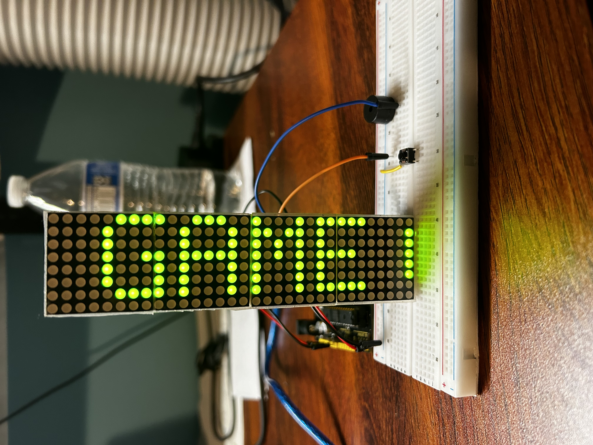
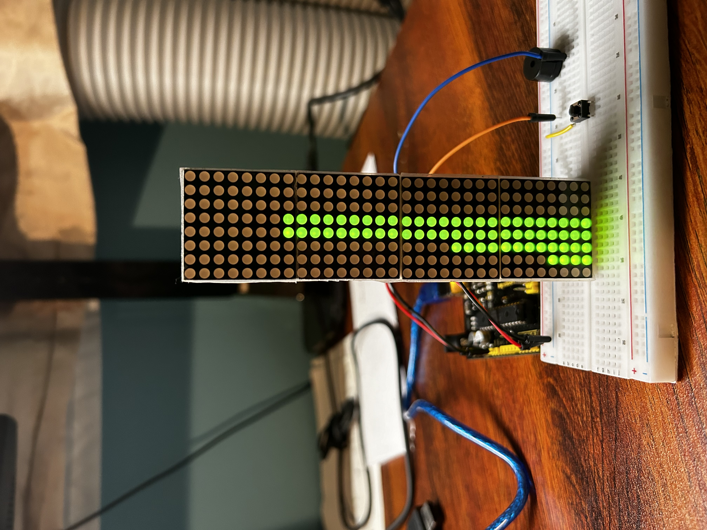
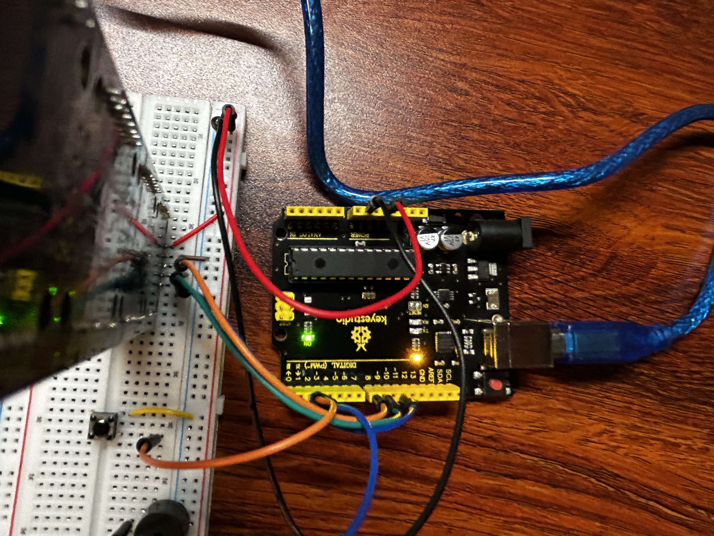
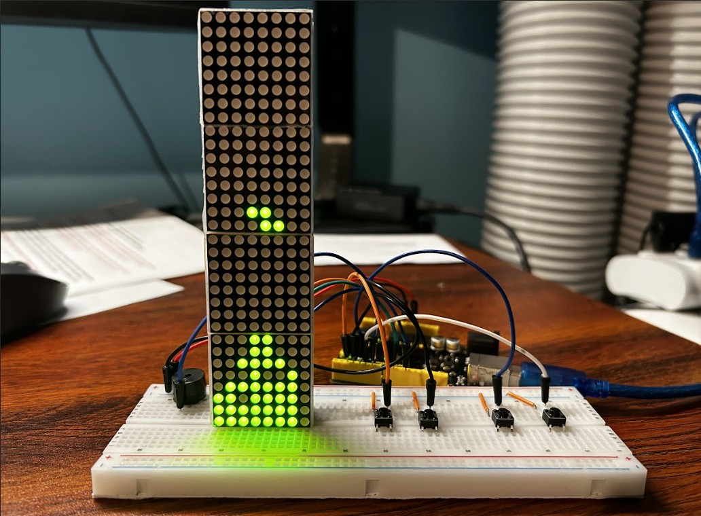

# Arduino-Stacker-8x32-Matrix-board
Stacker Game

Program: 
- Arduino.IDE

Library Dependencies:
- <MD_Parola.h>
- <MD_MAX72xx.h>
- <SPI.h>

Requirements:
- Arduino
- Breadboard
- 8x32 Matrix board
- (1-4) Buttons
- Passive Buzzer (optional)
- Jumper wires

  

  

  ------TETRIS------
 
  
